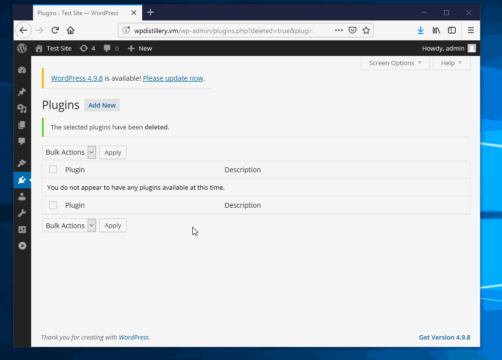
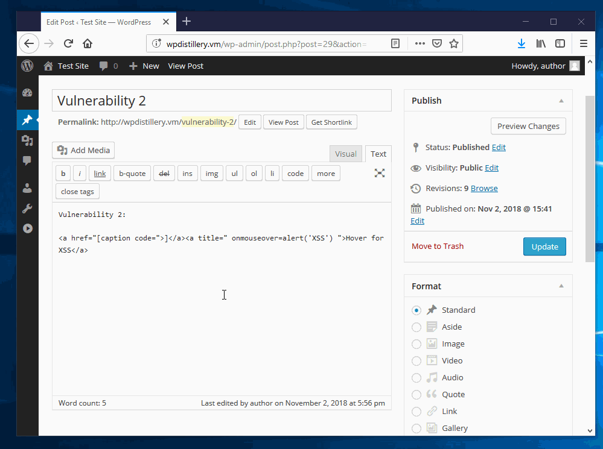
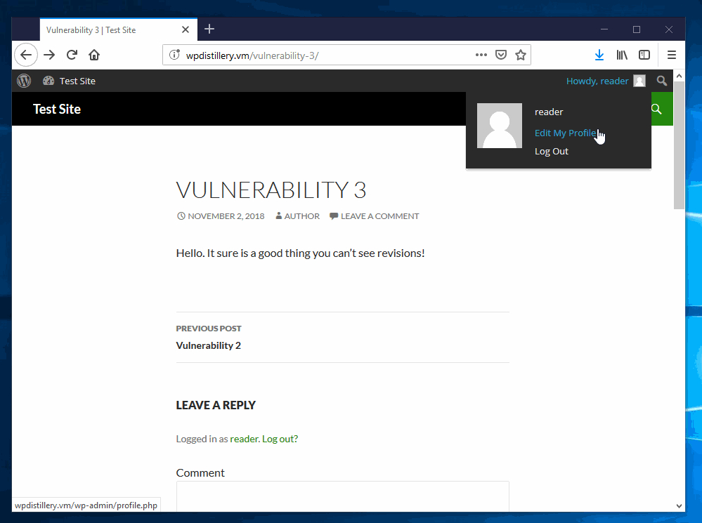
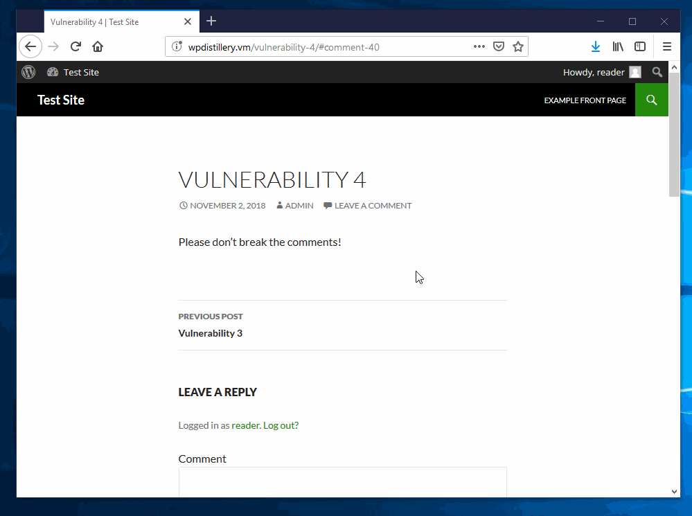
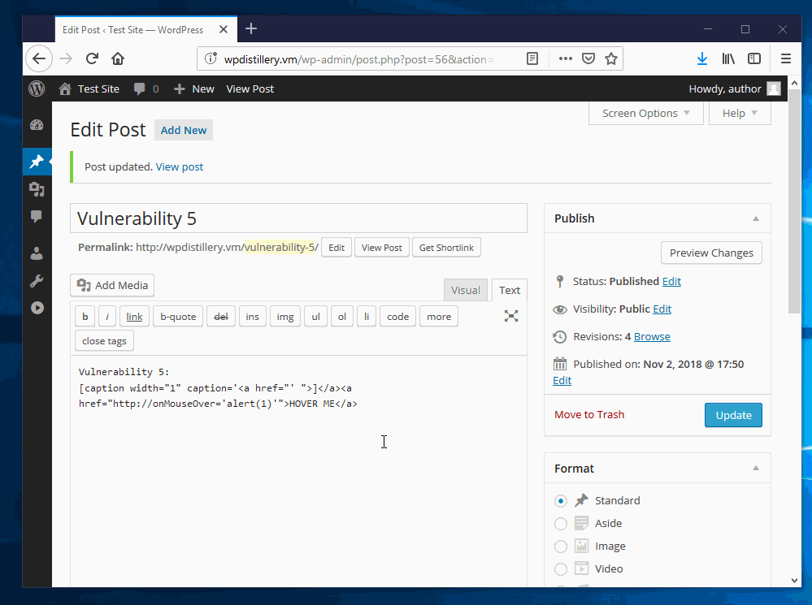

# Project 7 - WordPress Pentesting

Time spent: **9.5** hours spent in total

> Objective: Find, analyze, recreate, and document **five vulnerabilities** affecting an old version of WordPress

## Pentesting Report

1. (Required) Same\-Origin Method Execution CVE 2015\-3439
  - [x] Summary: Vulnerability in Plupload which is used in Wordpress. Uses *target* parameter to execute JavaScript.
    * Vulnerability types: Same-Origin XSS
    * Tested in version: 4.0
    * Fixed in version: 4.1.2
  - [x] GIF Walkthrough: 
  - [x] Steps to recreate: 
    1. Create a page that an admin might open.
	2. Add link that links to a page the hacker has control over (new tab) and also write JavaScript that redirects the current page to the targeted page where the XSS will occur.
	3. On the page located in the new tab run php similar to [proxy.php](proxy.php)
	4. This will begin the install of the plugin without interaction from the admin
  - [x] Affected source code:
    - [plupload.flash.swf](https://core.trac.wordpress.org/browser/tags/4.0/src/wp-includes/js/plupload/plupload.flash.swf) \- this is a binary file, the source for Plupload 2.1.2 is not included in WordPress
2. (Required) Authenticated Stored Cross\-Site Scripting (XSS) CVE 2015\-5622
  - [x] Summary: Vulnerability in JavaScript filtering. Allows authors/contributors to execute JavaScript when they shouldn't be able to.
    - Vulnerability types: XSS
    - Tested in version: 4.0
    - Fixed in version: 4.0.6
  - [x] GIF Walkthrough: 
  - [x] Steps to recreate: Add link that looks like: \<a href="\[caption code="\>\]\</a\>\<a title=" onmouseover=alert('XSS')  "\>LINK\</a\>
  - [x] Affected source code:
    - [kses.php](https://core.trac.wordpress.org/browser/tags/4.0/src/wp-includes/kses.php)
    - [shortcodes.php](https://core.trac.wordpress.org/browser/tags/4.0/src/wp-includes/shortcodes.php)
3. (Required) Authenticated Revision History Information Disclosure CVE 2016\-5835
  - [x] Summary: Having permission to read a post also gives access to many other pages that a reader should not have access to (revision history).
    - Vulnerability types: Insecure object reference \- it is not quite IDOR since the user must be logged in, but the permission assigned to the object being referenced is incorrect therefore allowing a user with read permissions to see revisions.
    - Tested in version: 4.0
    - Fixed in version: 4.0.12
  - [x] GIF Walkthrough: 
  - [x] Steps to recreate: Test revision IDs with http://wpdistillery.vm/wp-admin/revision.php?revision=ID until a readable post is found. This generally will only take a couple quick tries since by default all published posts are readable by all users.
  - [x] Affected source code:
    - [revision.php](https://core.trac.wordpress.org/browser/tags/4.0/src/wp-admin/includes/revision.php)
4. (Optional) Unauthenticated Stored Cross-Site Scripting (XSS) CVE 2015\-3438
  - [x] Summary: Comment filtering doesn't predict that certain characters will destroy the comment. Added one of these characters wipes the part of the comment after the character.
    - Vulnerability types: SQL Injection, XSS
    - Tested in version: 4.0
    - Fixed in version: 4.1.2
  - [x] GIF Walkthrough: 
  - [x] Steps to recreate: Post the follow comment on any page: Hover below for XSS
\<abbr title='x onmouseover=alert(1) style=display:block;width:50px;height:50px; 𝌆'\>
  - [x] Affected source code:
    - SQL configuration issue, no direct code located
5. (Optional) Authenticated Shortcode Tags Cross-Site Scripting (XSS) CVE 2015\-5714
  - [x] Summary: Vulnerability in shortcode tag substitution. Allows authors/contributors to execute JavaScript when they shouldn't be able to.
    - Vulnerability types: XSS
    - Tested in version: 4.0
    - Fixed in version: 4.0.8
  - [x] GIF Walkthrough: 
  - [x] Steps to recreate: Add to page a shortcode tag like this: [caption width="1" caption='<a href="' ">]</a><a href="http://onMouseOver='alert(1)'">HOVER ME</a>
  - [x] Affected source code:
    - [shortcodes.php](https://core.trac.wordpress.org/browser/tags/4.0/src/wp-includes/shortcodes.php)

## Assets

[proxy.php](proxy.php) (for vulnerability 1)

## Resources

- [WordPress Source Browser](https://core.trac.wordpress.org/browser/)
- [WordPress Developer Reference](https://developer.wordpress.org/reference/)

GIFs created with [LiceCap](http://www.cockos.com/licecap/).

## Notes

Wordpress automatically adds security patches on every startup (4.0=\>4.0.24, 4.4=\>4.16)

## License

    Copyright [2018] [Devin Attig]

    Licensed under the Apache License, Version 2.0 (the "License");
    you may not use this file except in compliance with the License.
    You may obtain a copy of the License at

        http://www.apache.org/licenses/LICENSE-2.0

    Unless required by applicable law or agreed to in writing, software
    distributed under the License is distributed on an "AS IS" BASIS,
    WITHOUT WARRANTIES OR CONDITIONS OF ANY KIND, either express or implied.
    See the License for the specific language governing permissions and
    limitations under the License.
